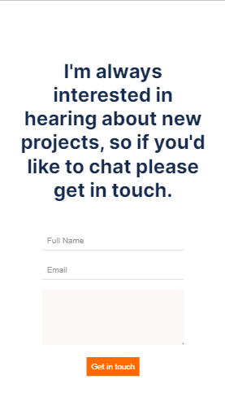

# curriculum-cr-training-contact-form

This repo host an initial code for the tasks performed during the Code Reviewers training.

Application is based on this [Figma design](https://www.figma.com/file/t3EJUCAEViw3QasuJLPLVT/Microverse-Student-Potfolio-Templates-Main?node-id=1%3A1471).

# Contact-Form
This is a trial code review repo which is about completing a portfolio website with the final contact form page.

## Built With

- HTML
- CSS
- Webhint and Stylelint

## Live Demo

N/A

## Getting Started

To get a local copy up and running follow these simple example steps.

- Open the terminal
- Run `git clone https://github.com/MahmoudBakr23/Contact-Form.git`
- Then run `git checkout feature`
- Now you can open the `index.html` file in your browser

## Authors

👤 **Mahmoud Bakr**

- GitHub: [@githubhandle](https://github.com/MahmoudBakr23)

## 🤝 Contributing

Contributions, issues, and feature requests are welcome!

Feel free to check the [issues page](https://github.com/MahmoudBakr23/Contact-Form/issues).

## Show your support

Give a ⭐️ if you like this project!

## Acknowledgments

- [Microverse Inc](https://www.microverse.org/).